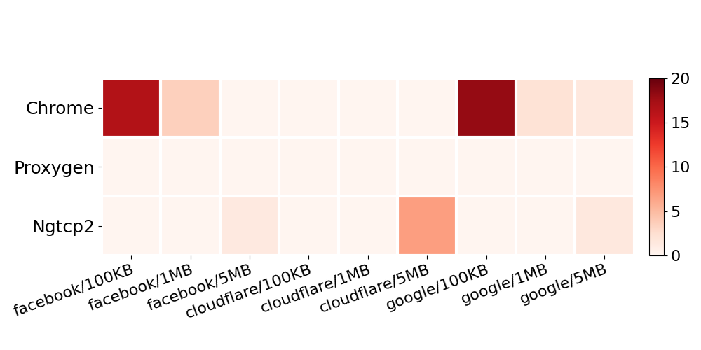
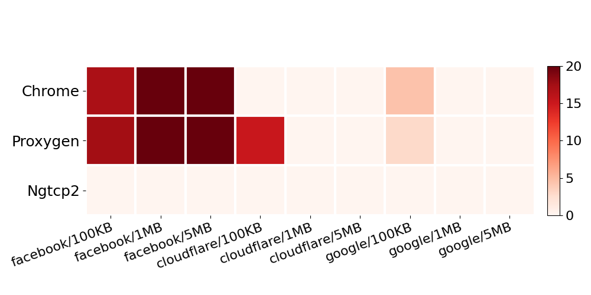

# QUIC Benchmarks

This repository is a set of tools to benchmark, compare, and analyze QUIC and TCP performance of production endpoints. So far, we have used this tool on endpoints from **Google**, **Facebook**, and **Cloudflare** which are detailed in `endpoints.json`. Below are some sample results between QUIC and TCP:

### QUIC vs TCP
Blue = Better H3 Performance

Red = Better H2 Performance

TTLB = Time To Last Byte

Percentage in heatmap cells = (H3 TTLB - H2 TTLB) / H2 TTLB

#### Extra Loss

Google | Facebook | Cloudflare
:-: | :-: | :-:
 |  | 

#### Extra Delay

Google | Facebook | Cloudflare
:-: | :-: | :-:
 |  | 

### QUIC Client Comparison

Lighter = Better performance

Darker  = Worse Performance

#### 1% Extra Loss



#### 100ms Extra Delay



## Usage

```
 ./benchmark.sh [url] -d [results dir] -n [iterations] [-s]

 [url]            - URL to benchmark
 -d [results dir] - Directory path to store results
 -n [iterations]  - Number of iterations to run
 [-s]             - Toggle signifying whether benchmarked URL is a 
                    single-object web resource or full web-page 
```

By default, the amount of benchmark iterations is 10. 

## Setup

You should have Docker and Python 3 installed. With those, you can then simply run `./benchmark.sh`

## Network Environments

10 MB bandwidth: `sudo tc qdisc add dev eth0 root tbf rate 10mbps`

100 ms delay: `sudo tc qdisc add dev eth0 root netem delay 100ms`

Burst loss: `sudo tc qdisc change dev eth0 root netem loss 0.3% 25%`

Clean up: `sudo tc qdisc del dev eth0 root`