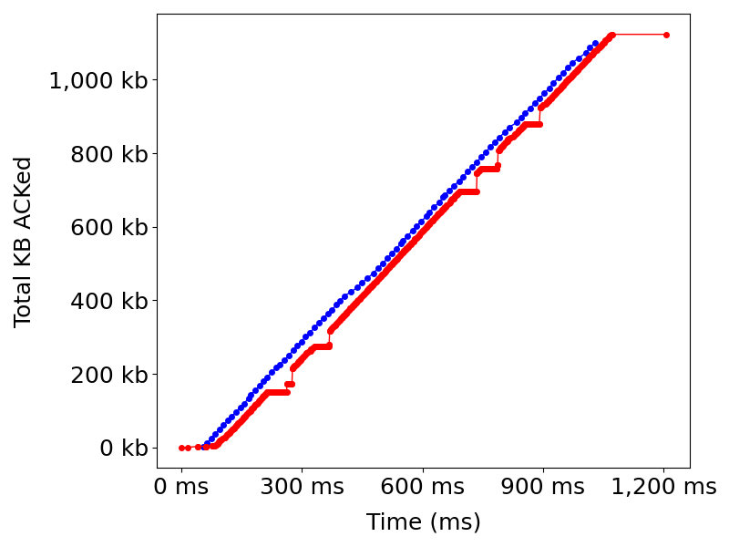
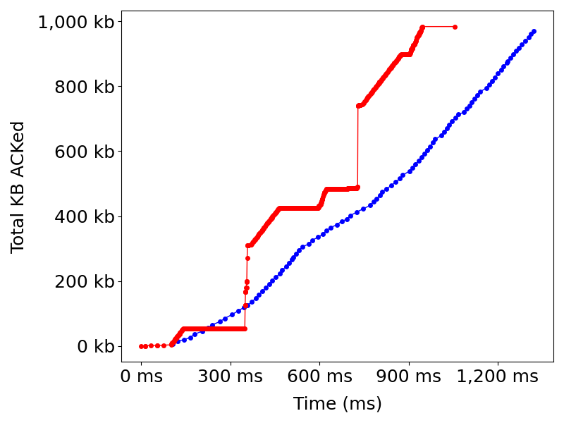
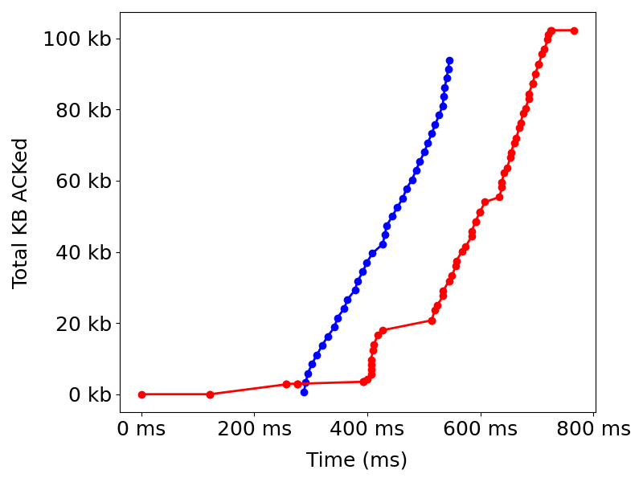
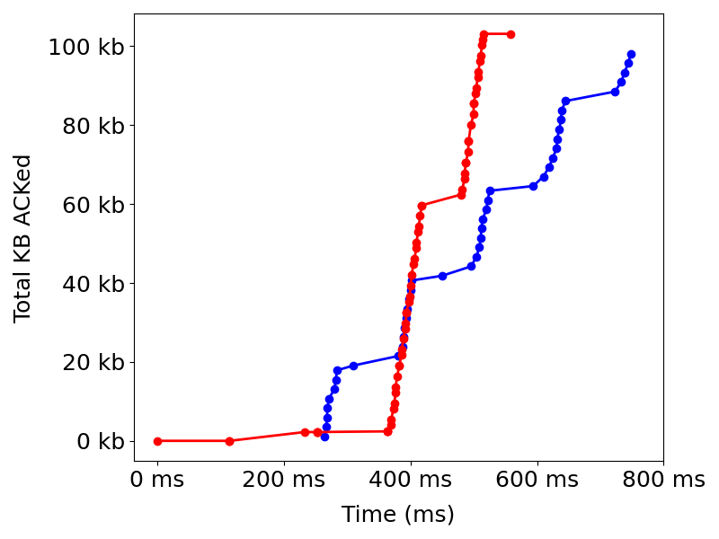

# QUIC Benchmarks

This repository is a set of tools to benchmark, compare, and analyze QUIC and TCP performance of production endpoints. So far, we have used this tool on endpoints from **Google**, **Facebook**, and **Cloudflare** which are detailed in `endpoints.json`. Below are some sample results between QUIC and TCP:

### QUIC vs TCP

*Various heatmaps showcasing QUIC versus TCP performance for single-object web resources. Red represents worse H3 performance as it indicates an increase in TTLB from H2 and H3 and vice versa. The number in each cell shows the exact percent difference in TTLB from H2 to H3.*

#### Extra Loss

Google | Facebook | Cloudflare
:-: | :-: | :-:
 |  | 

#### Extra Delay

Google | Facebook | Cloudflare
:-: | :-: | :-:
 |  | 

Some significant findings from these graphs are: 
- QUIC performs **better** than TCP for 100kb payloads
- QUIC performs **worse** than TCP against Cloudflare endpoints during high loss rates
- QUIC performs **worse** than TCP against Facebook endpoints during high latency
- QUIC performs **better** than TCP against Google endpoints during high latency

### QUIC Client Comparison

*Various heatmaps comparing QUIC performance across different clients. The tick marks on the colorbar represent percent differences in mean TTLB from the best performing H3 client. As such, 0% is the best value a client can achieve and the darker the color, the worse the performance.*

1% Extra Loss | 100ms Extra Delay
:-: | :-:
 | 

Some significant findings from these graphs are: 
- Ngtcp2 performs **signficiantly better** than other QUIC clients against Facebook endpoints during high latency
- Chrome performs **worse** than other QUIC clients for 100kb payloads
- Generally, QUIC clients have **equivalent** performance for most network and payload combinations

### ACK Analysis

*Red represents Chrome H2 and blue represents Chrome H3. Each dot in the graph represents an ACK packet/frame sent from the client.*

Google 1% loss 1mb | Cloudflare 1% loss 1mb | Google 100ms delay 100kb | Facebook 100ms delay 100kb
:-: | :-: | :-: | :-:
 |  |  | 

Some significant findings from these graphs are: 
- For Cloudflare endpoints during high loss, QUIC's throughput is less than TCP's but becomes equivalent later on
- For Facebook endpoints during high latency, QUIC traffic is sent in bursts whereas it is smooth for TCP


## Usage

```
 ./benchmark.sh [url] -d [results dir] -n [iterations] [-s]

 [url]            - URL to benchmark
 -d [results dir] - Directory path to store results
 -n [iterations]  - Number of iterations to run
 [-s]             - Toggle signifying whether benchmarked URL is a 
                    single-object web resource or full web-page 
```

By default, the amount of benchmark iterations is 10. 

## Setup

You should have Docker and Python 3 installed. With those, you can then simply run `./benchmark.sh`

## Network Environments

10 MB bandwidth: `sudo tc qdisc add dev eth0 root tbf rate 10mbps`

100 ms delay: `sudo tc qdisc add dev eth0 root netem delay 100ms`

Burst loss: `sudo tc qdisc change dev eth0 root netem loss 0.3% 25%`

Clean up: `sudo tc qdisc del dev eth0 root`