# Results

| Bandwidth | Loss | Delay (RTT) |
| --------- | ---- | ----------- |
| 10 MB     | 0%   | 0ms         |
| 10 MB     | 5%   | 0ms         |
| 10 MB     | 0%   | 200ms       |
| 10 MB     | 5%   | 200ms       |

## Facebook

20 Iterations for each endpoint. Graphs show mean of total time to load the web 
page. Curl and HQ have poorer results in the smaller sized pages since they are
run in subprocesses and the time measurement consists of the process starting 
and exiting.

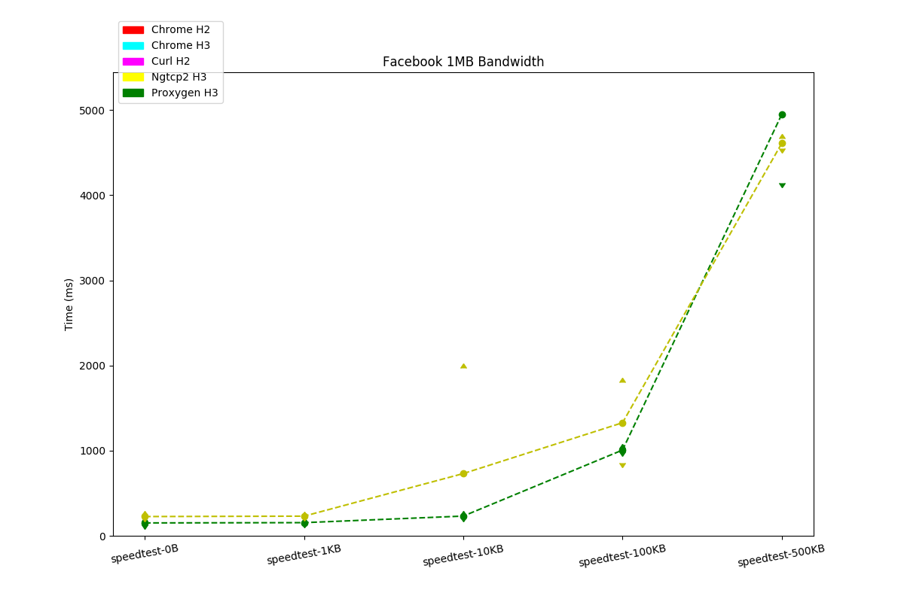
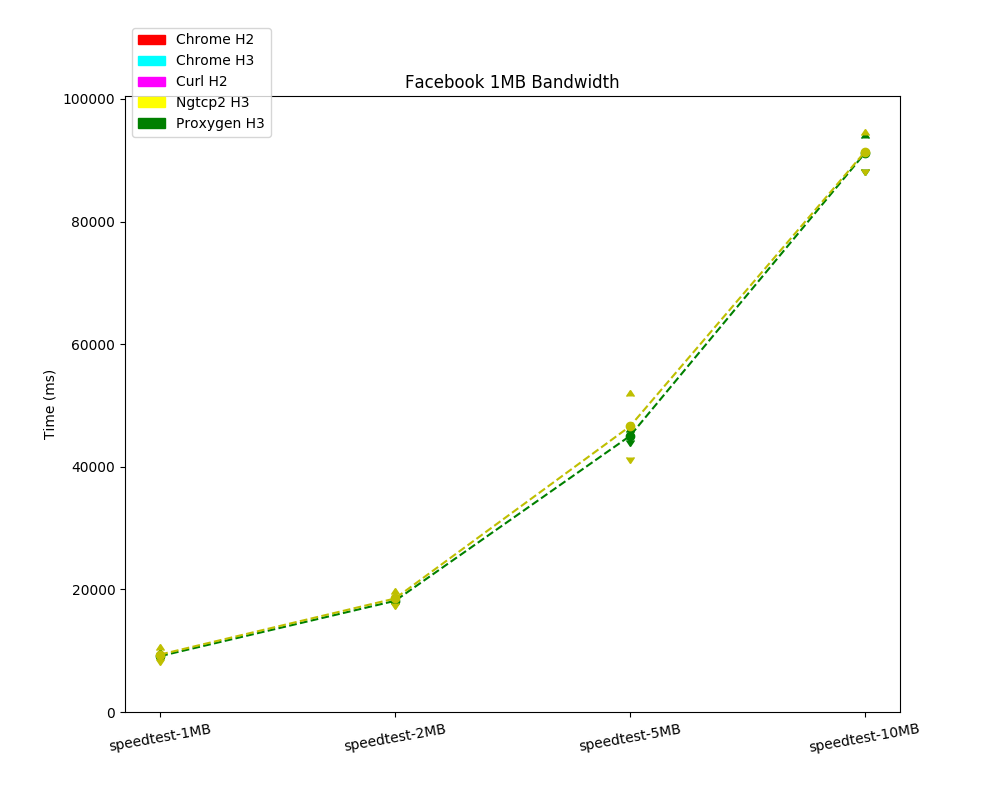
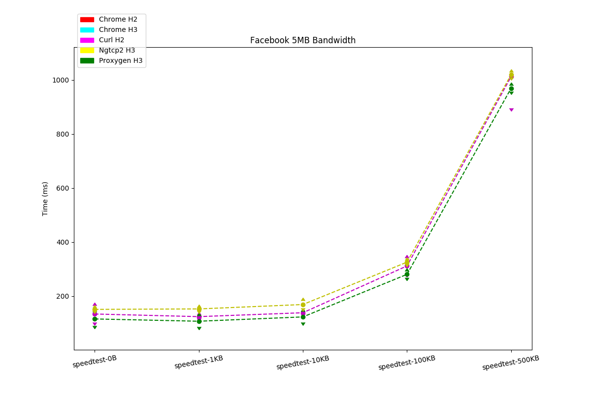

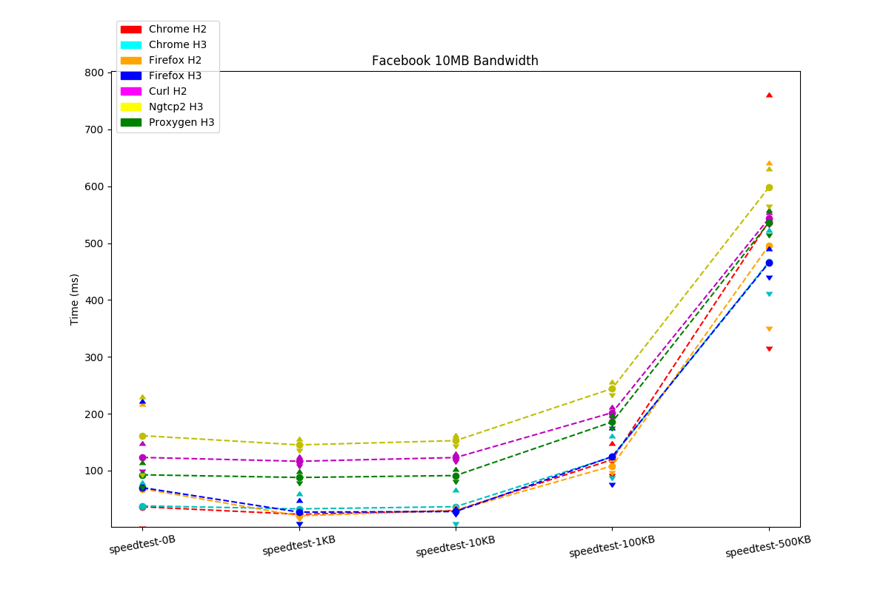
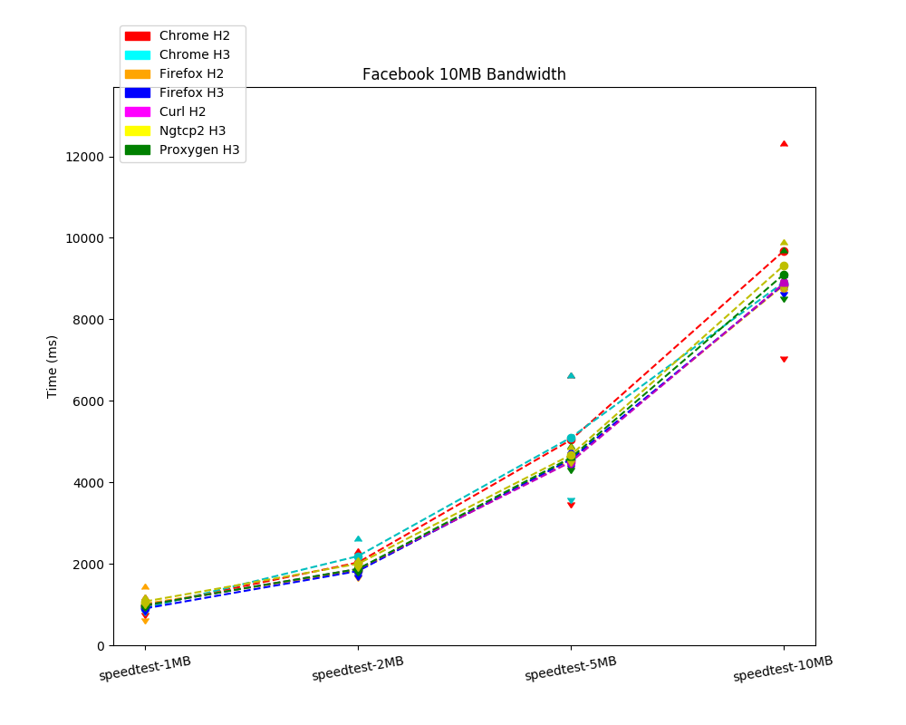
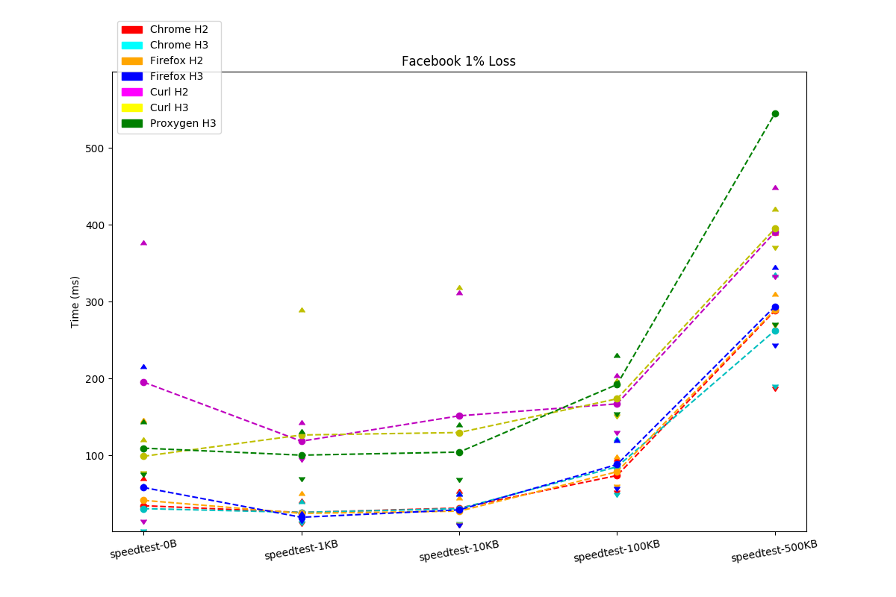
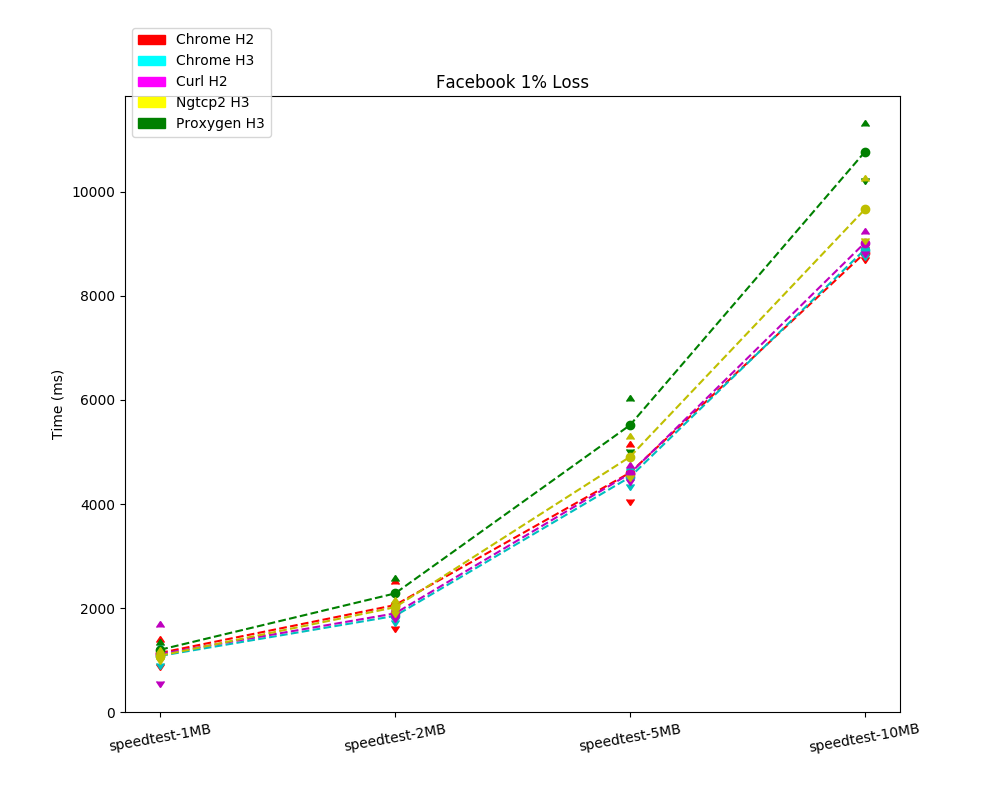
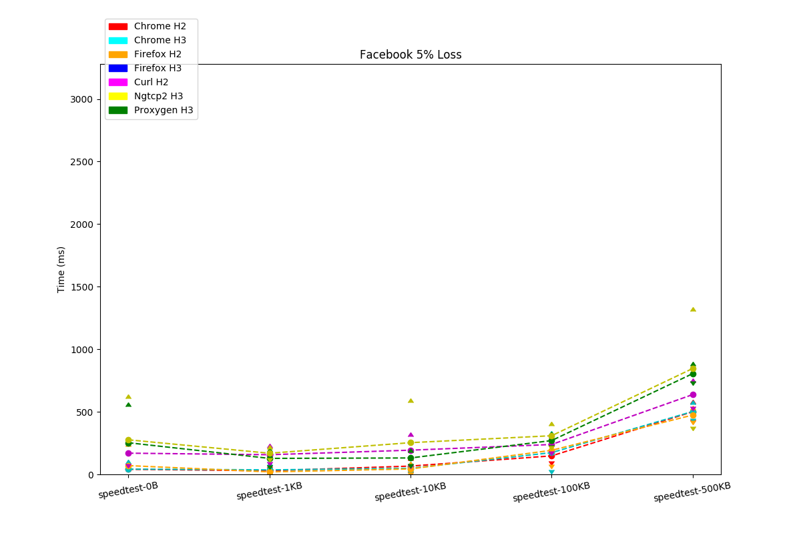
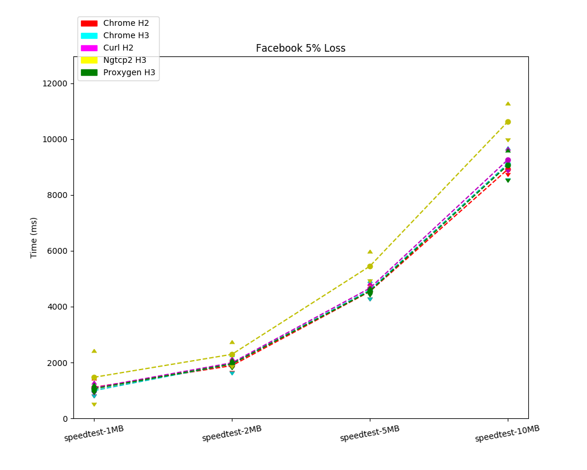
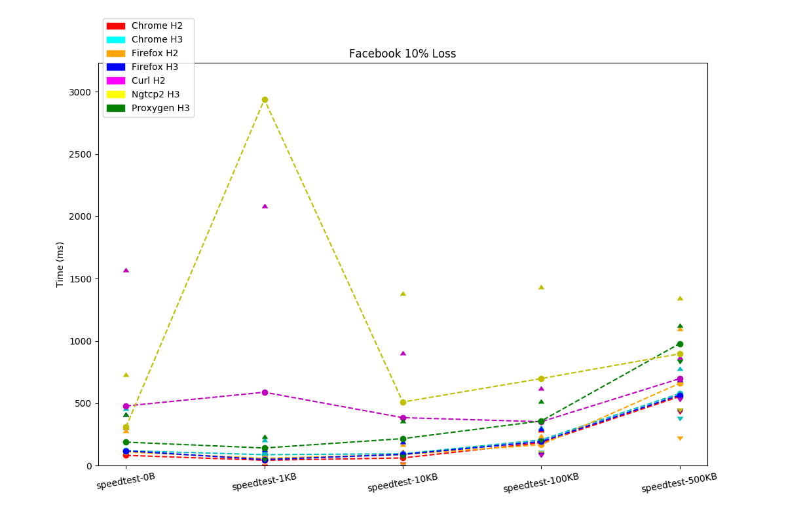
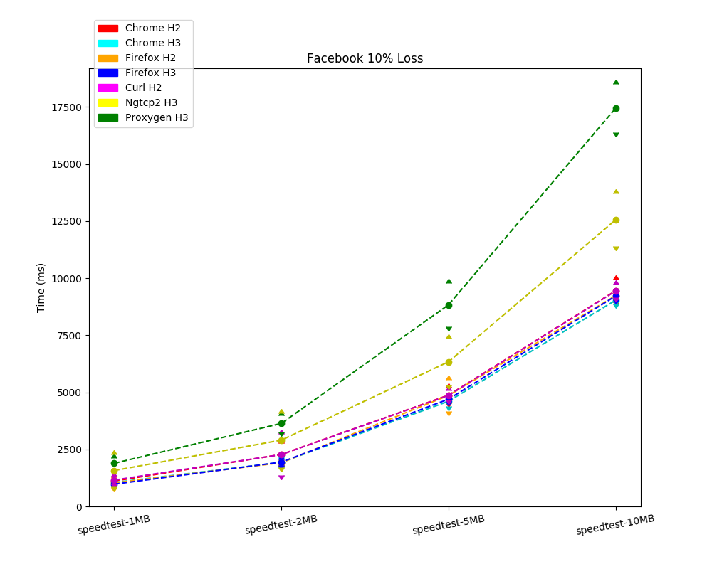

### Conclusion

No egregious discrepancies. H3 and H2 performance seem quite similar.

## Cloudflare

## Microsoft

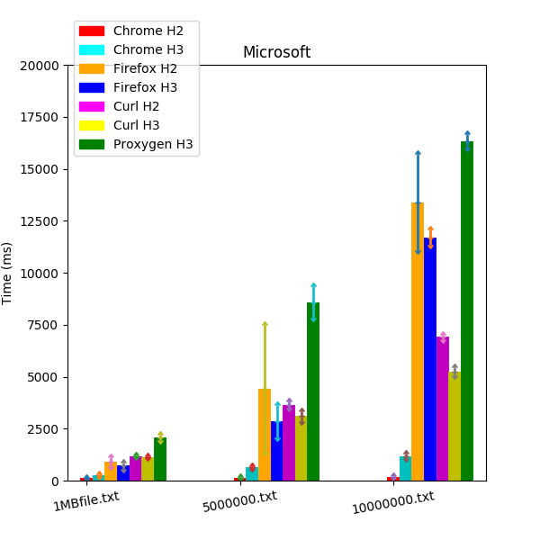

## F5

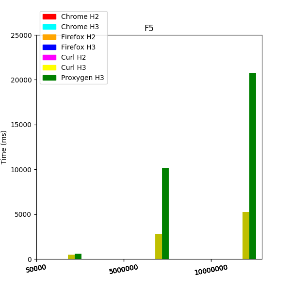